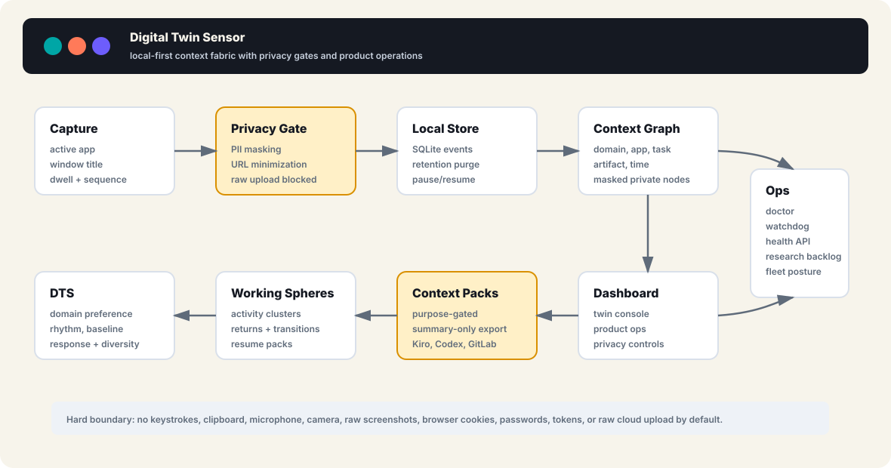
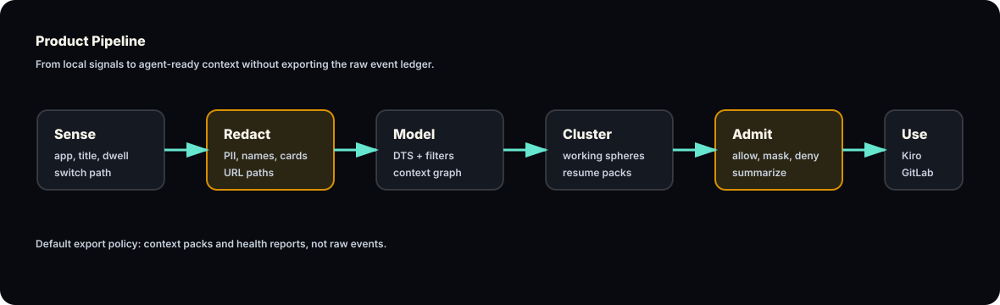
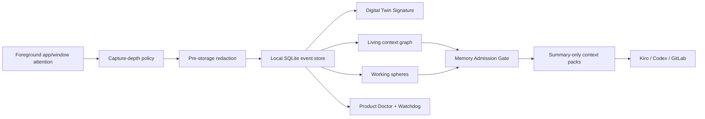
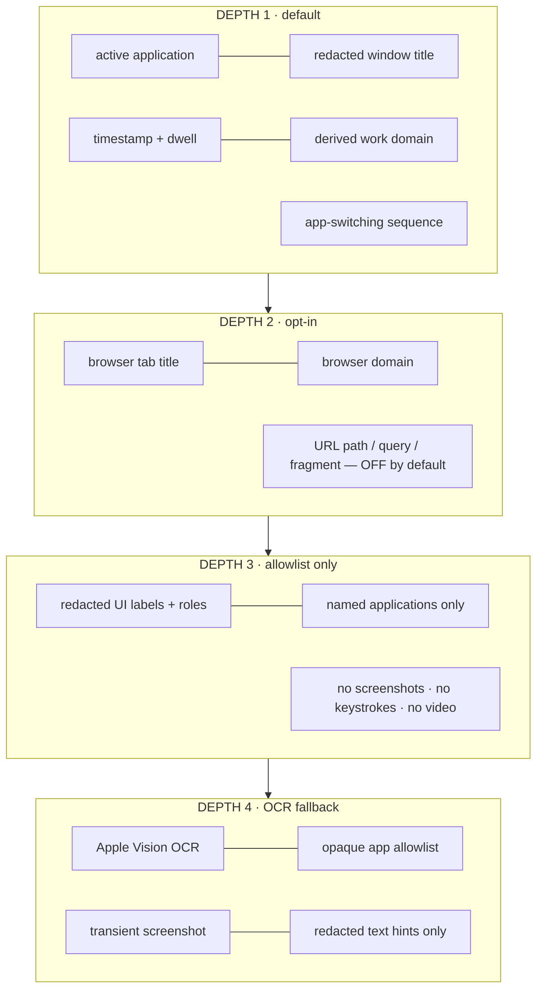
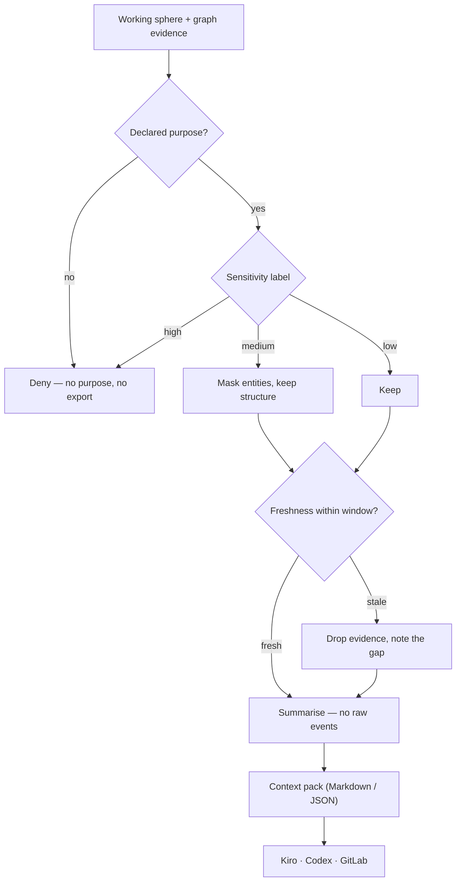
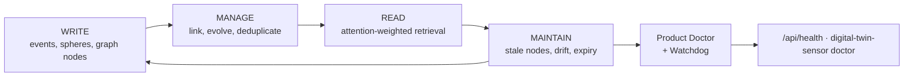
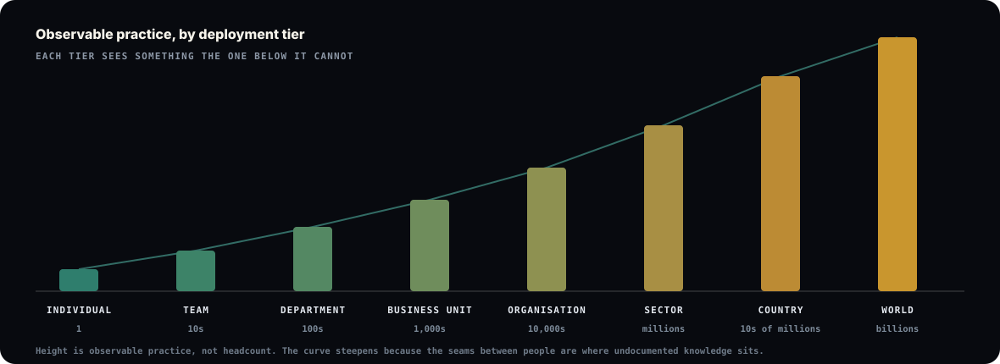
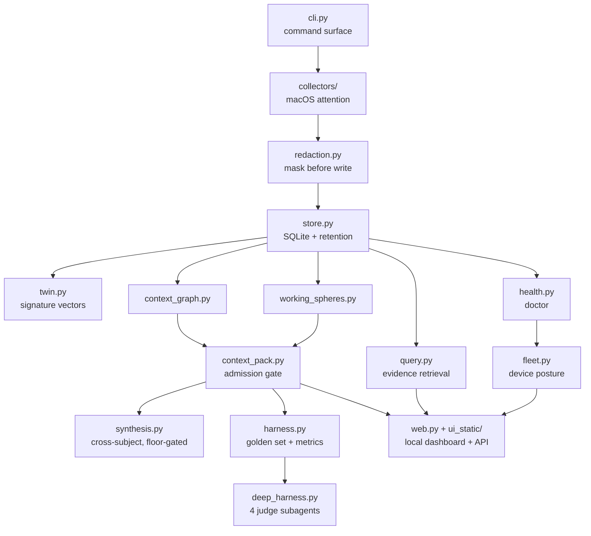

# Digital Twin Sensor

**31 August hardening update:** [What changed and what remains unproven](docs/HARDENING_2026_08_31.md) | [Claude handover](docs/CLAUDE_HANDOVER.md).

**Resume my work:** the dashboard now separates observed activity, inferred suggestions, and checkpoints you confirm. [Workflow, API, and limitations](docs/RESUME_WORKFLOW.md).

**A local-first, privacy-gated context sensor for personal and enterprise context engineering.**


Enterprise context does not live in documents. It lives in how work actually happens — what people attend to, in what order, what they abandon and return to. Documents are the residue of that process, not the process itself.

This is a working sensor for the process. It observes lightweight computer-use signals on macOS, **redacts before it stores**, builds a living context graph, infers working spheres, and exports summary-only context packs for tools such as Kiro, Codex and GitLab.

It is inspired by X-SYNTH, context-engineering and agent-memory research, but it makes one deliberate product choice: **a digital twin should not be a raw surveillance log.** It should be an explainable, governed context system with visible user control.

> **Read the argument first:** [The Empty Window](https://gagansachdeva.com/writing/the-empty-window.html) · [Context Is The Moat](https://gagansachdeva.com/showcase/digital-twin-sensor/context-moat/) · [Visual case study](https://gagansachdeva.com/showcase/digital-twin-sensor/)

---

## Architecture



Every box runs locally. Agent handoff packs pass through the admission gate. The explicit local `export` command is a separate audit export of stored event records and should not be shared as an agent pack. The sensor remains useful with the network off.

---

## The pipeline



Two of the six stages are gates, not transforms. Redaction happens **before the write**, not before the query — which is the whole difference between a governed sensor and a surveillance log with a filter bolted on.



---

## Capture depth — three separate decisions

Nothing escalates on its own. Each depth is an explicit switch, and each one refuses more than it grants.



The domain tells you the workstream. The query string tells you far more than anyone consented to. That is why they are separate flags.

```bash
# attention shape only — the default
digital-twin-sensor collect-once

# add browser tab context, leave URL internals off
digital-twin-sensor configure --depth 2 --browser-tab-details on \
  --browser-url-path off --browser-url-query off

# add redacted interface labels, for one named app
digital-twin-sensor configure --depth 3 --accessibility-surface-details on \
  --accessibility-app "Ibo Pro Player"

# add local OCR summaries only after structured metadata is exhausted
digital-twin-sensor configure --depth 4 --ocr-surface-details on \
  --ocr-app "Ibo Pro Player" --ocr-max-lines 12 --ocr-min-confidence 0.35
```

Full policy: [COLLECTION_DEPTH_AND_REDACTION.md](COLLECTION_DEPTH_AND_REDACTION.md)

---

## The privacy boundary

| Collected by default | Never collected |
| --- | --- |
| active application | keystrokes |
| redacted window title, if enabled | clipboard contents |
| timestamp and dwell time | microphone / camera |
| derived work domain | continuous screen recording or video |
| app-switching sequence | browser cookies |
| graph / sphere / pack metadata | passwords or tokens |
| Depth 4 redacted OCR text hints, if explicitly enabled | persisted screenshots |
| | raw URL paths, queries, fragments |
| | any raw cloud upload |

PII masking runs before events are written to SQLite. The redactor masks emails, Luhn-validated card numbers, US SSNs, phone numbers, IP addresses, common secret and token shapes, URL paths, and configured names.

Depth 4 OCR uses local providers only. On macOS the installer builds a small helper that prefers Apple Vision `VNRecognizeTextRequest` and can fall back to the Tesseract CLI when installed. The active product stores redacted hints and confidence, not image pixels.

A worker who believes they are being logged changes what they do — and then you have captured the performance instead of the practice. The boundary is not a setting. It is the product.

---

## The Memory Admission Gate

Nothing reaches an agent because it exists in the store. It reaches an agent because a gate decided it should, for a stated purpose.



Every pack records what was withheld and why. An agent that cannot tell you what it did not have cannot be trusted with what it did.
---

## How attention is defined

Attention is not time on screen. Dwell alone rewards the window you left open while you
went to lunch. The Digital Twin Signature models it as a distribution with a shape:

| Vector | Measures | How |
| --- | --- | --- |
| `v_dom` | where attention goes | dwell distribution across work domains |
| `v_rhythm` | when it goes there | hour-of-day histogram |
| `v_base` | what normal looks like | short window (5d) vs long window (14d) |
| `v_resp` | how attention moves | domain-to-domain transition counts |
| `v_div` | concentration and drift | Shannon entropy + KL divergence, short vs long |

`KL(short ‖ long) > 0.2` means the recent week does not look like the fortnight. The system
treats that as a trigger, not a statistic — retrieval automatically adds a `differential`
filter when it fires.

Retrieval then picks an **attention filter** from cues in the question itself and weights
evidence by it: `proportional` (default), `inverse` (what was *neglected* — absence as
signal), `differential` (what changed), `recurrent` (returned to), `comparative`,
`sequential`, `collective`. Final rank is `attention × content`. Content alone finds the
document; attention decides whether the person was actually working on it.

Working spheres then reconnect interrupted work by scoring each event against every open
sphere — same artifact **0.46**, token overlap up to **0.48**, same domain 0.18, same task
0.13, same app 0.12. Artifact identity dominates on purpose: a browser is a browser, but
returning to *the same thing* is strong evidence. That is what lets the system say "you
were interrupted here, three times" instead of "you used Chrome for four hours".

Full walkthrough: [docs/UNDER_THE_HOOD.md](docs/UNDER_THE_HOOD.md)

---

## The synthesis layer

One sensor answers *what was this person doing*. The layer an institution needs answers
*what is the work here* — without letting any individual trace be reconstructed from the
output. So the floor comes first:

```
a theme is emitted only when N distinct subjects independently support it
```

`synthesis.py` reads gated working spheres — never raw events — keyed by opaque subject
hashes. Below-floor themes are withheld **and counted**, so an operator sees that
suppression happened rather than quietly getting a thinner answer. Confidence is
`0.65 × breadth + 0.35 × depth`, weighting corroboration across people above volume from
any one person, so a single prolific subject cannot manufacture a theme alone.

Those weights are a hand-chosen prior, not a result — not from a paper, and never fitted
against labelled data, because none exists yet. Only the direction is defensible. The
aggregation floor underneath is standard count-based k-anonymity; see
[docs/UNDER_THE_HOOD.md](docs/UNDER_THE_HOOD.md) for what that does and does not buy.

```bash
digital-twin-sensor synthesize --min-subjects 5
```

```
| theme                             | subjects | events | hours | confidence |
| coding — gateway logic payments   |        7 |     70 |   7.0 |      0.805 |

## Withheld
- Topic withheld: below aggregation floor (minimum 5 subjects).
```

This is what makes anything above a single team defensible, and it has to exist *before*
deployment widens — an aggregation floor is cheap at ten endpoints and impossible to
retrofit at ten thousand.

---

## The evaluation harness

Unit tests prove a function returns what it was told to. They cannot tell you whether the
context handed to an agent is good — relevant enough to be useful, tight enough to be safe.

`harness.py` runs a golden set end to end and scores **recall**, **noise ratio**,
**leaks**, **evidence age**, **pack size** and **gate decisions**. A leakage canary
reaching an export is a hard failure whatever the recall score.

```bash
digital-twin-sensor harness                  # markdown report
digital-twin-sensor harness --format json    # machine-readable
digital-twin-sensor harness --fail-under 0.8 # tighten the recall floor
digital-twin-sensor harness --baseline harness/baseline.json   # fail on drift, not only on the floor
```

Non-zero exit on any leak or recall miss, wired into CI, so a context regression breaks
the build exactly like a failing test.

### Two gates, because a floor cannot see drift

A pass/fail floor answers one question: is the context good enough right now. It cannot
see a system quietly getting worse while staying above the line — recall sliding 0.98 to
0.80 over a quarter reads green every run, which is exactly the failure this project
argues nobody measures.

So the last accepted scores are committed to `harness/baseline.json` and every run is
diffed against them. A drop beyond tolerance fails the build whatever the absolute score,
and so does **a gate that stops denying while recall improves** — the case that looks
like progress and is not. Improvements never fail; the baseline is refreshed deliberately
with `--update-baseline`.

### Fuzzing the leak gate

The golden set proves the canaries somebody thought of do not escape. It says nothing
about the ones nobody thought of, which is the population that matters for a leak.
`tests/test_fuzz_leak_gate.py` generates hostile inputs instead — cards split across odd
separators, tokens with mixed separators, IDs buried in window-title noise — and asserts
two invariants over thousands of them: nothing redaction claims to mask survives
`redact_text`, and nothing masked at capture reappears in an export. Seeded and
standard-library only, so a failure is reproducible from the seed in the message.

```bash
python3 -m unittest tests.test_fuzz_leak_gate            # fast, in the default suite
FUZZ_ITERATIONS=5000 python3 -m unittest tests.test_fuzz_leak_gate   # soak, as CI runs it
```

> **It found three real bugs on its first two runs.** A neighbouring digit hid a card
> number: `Invoice 3 4111 1111 1111 1111` merged the stray `3` into the candidate span,
> failed Luhn as a unit, and handed the whole card back unmasked — a one-character
> evasion. Secret detection was prefix-correct but character-class-narrow, so tokens
> carrying mixed `-`/`_` separators walked through. And `_gate_counts` read decisions
> from the pack root instead of `admission`, so the harness had been reporting an empty
> gate for every scenario since it was written. Each is now a named regression test.

### Where determinism runs out

A canary proves a known string did not escape. It cannot tell you whether someone could
*resume the work* from a pack, or what an adversary could **infer** from one that leaked
no literal PII. `deep_harness.py` answers those with a planner and four sub-agents in
isolated context windows — `resumability-judge`, `leakage-adversary`, `synthesis-critic`,
`gap-analyst` — running over the real pipeline via read-only tools.

```bash
pip install -e ".[deep-eval]"     # optional extra, Python >=3.11
digital-twin-sensor deep-harness
```

It runs on synthetic fixtures and never touches the local event store: sending real
captured attention to a model API is precisely what this product exists to avoid. It is
a review aid, not a gate — the deterministic harness stays in CI, and `dependencies = []`
stays true for the sensor itself.

> **It paid for itself on the first run.** The harness failed `stale_evidence`: events
> 60 days old exported inside a 3-day window. `days` was threaded through the builders as
> *metadata* and enforced only by `EventStore.fetch_window` — so any caller passing events
> directly got stale evidence stamped with a fresh window. Fixed in `store.filter_window`,
> enforced in all three builders, regression test added. Twenty-two unit tests had not
> found it.

---

## Memory as an operable service

Agent memory degrades silently unless someone maintains it. This treats memory quality as an operations problem with visible health checks, not as a hidden backend detail.



The Product Ops surface reports stale nodes, disconnected graph communities, duplicate memories, sensitive rows nearing retention expiry, retrieval drift, and context cards with weak evidence support.

---

## From one machine to a fleet



One sensor is a personal tool. The interesting property of this class of system is that value does not scale linearly with deployment — it changes *kind* at each tier. New context appears that was invisible one level down, and with it a new set of things that can run without anyone asking.

| Tier | Sees what the tier below cannot | Starts running by itself | What it costs |
| --- | --- | --- | --- |
| **Individual** | your own attention trace | resume packs after every interruption | your own consent, nothing more |
| **Team** | the seam between people | expertise routing by practice, not job title | ten people can re-identify each other from "anonymous" data |
| **Department** | process as practised vs as written | self-maintaining process map; exception patterns | aggregation floors become mandatory |
| **Business unit** | the shadow operating model | measured hand-off latency; controls people route around | the findings will embarrass someone |
| **Organisation** | institutional memory as a maintained asset | agents grounded in how *this* firm decides | works councils, regulators, a real internal argument |
| **Sector** | practice compared across firms, federated | benchmarks of *how*, not just *what* | only works with cohort-size floors |
| **Country** | where skills actually sit | policy effects measured in weeks | stops being a company's decision |
| **World** | a live map of how human work is done | a training substrate for systems that understand work | the engineering is the easy half |

The path from one sensor to a billion is packaging, enrollment, policy distribution and a sync protocol. All solved problems in endpoint management; none of them research. Somebody will build it. The only real question is whether the version that wins has a gate in it — and gates are cheap at tier one and impossible to retrofit at tier six.

Fleet model and control-plane specification: [ENTERPRISE_PORTABILITY.md](ENTERPRISE_PORTABILITY.md)

---

## Implementation status

Honest accounting. The endpoint half is built; the control plane is specified, not shipped.

| Capability | Status |
| --- | --- |
| Attention collector with depth policy | ✅ built |
| Pre-storage redaction | ✅ built |
| Local SQLite store with retention purge | ✅ built |
| Digital Twin Signature | ✅ built |
| Context graph and working spheres | ✅ built |
| Memory Admission Gate + context packs | ✅ built |
| Product Doctor, watchdog, learning maintenance, health API | ✅ built |
| Fleet posture: identity, policy, connectors, sync-readiness | ✅ built |
| Eleven-tab local dashboard | ✅ built |
| Context-pack evaluation harness + golden set | ✅ built |
| Collective synthesis with aggregation floor | ✅ built |
| Deep-agent judgement harness (optional extra) | ✅ built |
| Rolling-window enforcement in all builders | ✅ built |
| Field-level encryption at rest (optional extra) | ✅ built |
| Structured app connectors v1 (manifest-declared, depth-aware) | ✅ built |
| Local OCR summary gate for opaque apps | ✅ built |
| Trust-calibration surfacing (confidence, evidence age) | 🟡 partial |
| Memory maintenance diagnostics | 🟡 partial |
| Evolving context cards | ✅ built |
| Feedback-labelled pack evaluation | 🟡 partial |
| Semantic retrieval + learned Query × Signature router | ⬜ designed |
| NER-backed redaction beyond regex | ⬜ designed |
| Event-schema versioning and migration | ⬜ designed |
| Signed pack provenance | ⬜ designed |
| Encrypted local store, signed installers | ⬜ designed |
| Remote control plane, enrollment, audit log | ⬜ designed |
| Windows / Linux endpoints | ⬜ designed |

---

## Learning Mode

Learning Mode turns context packs from one-way exports into a local teaching loop. Every ready pack now has a stable `pack_id`, every artifact and recent-path item has an opaque `evidence_key`, and the dashboard can label a pack or evidence item as useful, wrong, stale, too broad, too private, or missing context.

Those labels are stored locally in `context_feedback` with redacted notes, then folded into evolving `context_cards`. A card represents a working sphere plus its latest confidence, evidence count, sensitivity, open questions, and next maintenance actions. This is deliberately local-first: labels improve the product's maintenance view today, while learned routing is still future work until enough labelled data exists to calibrate it honestly.

CLI:

```bash
digital-twin-sensor learning --format markdown
digital-twin-sensor feedback add --pack-id pack_xxx --sphere-id sphere_xxx --label useful
```

API:

```text
GET  /api/learning
POST /api/feedback
```

---

## Research grounding

This is not a from-scratch invention. Each design decision traces to something in the 2024–2026 literature, and the table below is the honest map of what was read, what it changed, and whether that change is actually in the code.

| Paper | What it changed here | In code |
| --- | --- | --- |
| [X-SYNTH](https://arxiv.org/abs/2605.15505) — enterprise context from observed attention | Digital Twin Signature, attention filters, evidence weighting | ✅ |
| [Context Engineering Survey](https://arxiv.org/abs/2507.13334) | framed the product as a pipeline, not a dashboard | ✅ |
| [Memory in the Age of AI Agents](https://arxiv.org/abs/2512.13564) | split memory into event / sphere / graph / pack | ✅ |
| [Digital Twins as Funhouse Mirrors](https://arxiv.org/abs/2509.19088) | refuse to claim a faithful human replica; show evidence gaps | ✅ |
| [Agent-Native Memory Systems](https://arxiv.org/html/2606.24775v1) | expose representation / extraction / retrieval / maintenance as health checks | 🟡 |
| [Trust Calibration in Twin Agents](https://arxiv.org/abs/2605.19838) | show confidence and error attribution before an agent speaks *as* the user | 🟡 |
| [A-Mem](https://arxiv.org/abs/2502.12110) — agentic memory | evolving, linked memory instead of append-only logs | ⬜ |
| [Agentic Context Engineering](https://arxiv.org/abs/2510.04618) | curate contexts as playbooks without context collapse | ⬜ |
| [Memory for Autonomous LLM Agents](https://arxiv.org/html/2603.07670v1) | write / manage / read model plus maintenance jobs | ⬜ |
| [Context Engineering via Digital-Twin MDP](https://arxiv.org/abs/2603.22083) | use feedback labels to evaluate pack policy offline | ⬜ |

Full synthesis with product implications: [CONTEXT_RESEARCH_SYNTHESIS_2024_2026.md](CONTEXT_RESEARCH_SYNTHESIS_2024_2026.md) · extended reading: [RELATED_CONTEXT_PAPERS.md](RELATED_CONTEXT_PAPERS.md)

### How this should be described

> a privacy-gated context synthesis system from digital attention traces

Not a faithful human replica. Known gaps: learned Query × Signature router, feedback-labelled evaluation, collective/team signal, encrypted storage, trust-calibration studies, an anti-overclaim benchmark.

### Hypotheses worth testing

- **H1** — Privacy-gated context packs improve task resumption over no context and over query-only retrieval.
- **H2** — Working-sphere retrieval beats flat top-k event retrieval for interrupted work.
- **H3** — Summary-only packs reduce leakage risk while preserving handoff utility.
- **H4** — A visible Product Doctor improves trust calibration compared with a hidden collector.
- **H5** — Memory maintenance reduces stale-context errors over multi-week use.

Study design and metrics: [docs/RESEARCH_AND_EVALUATION.md](docs/RESEARCH_AND_EVALUATION.md)
---

## Quick start

```bash
git clone https://github.com/gagans23/digital-twin-sensor.git
cd digital-twin-sensor
python3 -m venv .venv
source .venv/bin/activate
pip install -e .

digital-twin-sensor init
digital-twin-sensor collect-once
digital-twin-sensor profile
digital-twin-sensor ui
```

Open <http://127.0.0.1:8765/>.

Do not open `digital_twin_sensor/ui_static/index.html` directly — the dashboard needs the local API server.

### macOS permissions

The active-window collector uses macOS Accessibility APIs through a native helper, with an AppleScript fallback. Enable your terminal or Python runtime under **System Settings → Privacy & Security → Accessibility**. Depth 2 and Depth 3 may additionally prompt for Automation permission for Safari, Chrome, or allowlisted apps. Depth 4 OCR may prompt for Screen Recording permission because the helper creates a temporary window image and deletes it immediately after local OCR.

### Install as a background sensor

```bash
chmod +x scripts/install_launch_agent.sh scripts/install_dashboard_agent.sh scripts/install_watchdog_agent.sh scripts/install_learning_agent.sh
scripts/install_launch_agent.sh
scripts/install_dashboard_agent.sh
scripts/install_watchdog_agent.sh
scripts/install_learning_agent.sh
digital-twin-sensor doctor
```

Four LaunchAgents, four jobs:

| Service | Role |
| --- | --- |
| `com.local.digital-twin-sensor` | continuous collector |
| `com.local.digital-twin-dashboard` | local dashboard on `127.0.0.1:8765` |
| `com.local.digital-twin-watchdog` | scheduled self-heal check every 60 seconds |
| `com.local.digital-twin-learning` | scheduled context-card refresh every 15 minutes |

The watchdog and learning maintenance jobs are scheduled rather than resident, so a healthy `launchctl print` may show them as `not running` with a recent zero exit code. That is correct.

---

## Module map



`config.py` holds capture-depth policy, device identity and retention settings; every module reads its limits from there rather than deciding for itself.

---

## Dashboard

Eleven tabs, each answering a different question:

| Tab | Question it answers |
| --- | --- |
| Overview | what is the twin's current state and privacy posture? |
| Signal Depth | what is being captured, at what depth, and what is refused? |
| Product Ops | is the memory service healthy — and where is it drifting? |
| Fleet | what is this endpoint's policy, connector and sync posture? |
| Activities | what work is open, suspended, or waiting to resume? |
| Context Packs | what would an agent actually receive, and what was withheld? |
| Context Graph | how does this work connect to other work? |
| Twin Signature | what behavioural patterns does the attention trace imply? |
| Evidence | what supports a given retrieval, and how fresh is it? |
| Events | the raw redacted local ledger |
| Privacy | captured / not-captured ledger, pause, resume, retention purge |

---

## Common commands

```bash
# collect and analyse
digital-twin-sensor collect-once
digital-twin-sensor run --interval 15
digital-twin-sensor profile --short-days 5 --long-days 14
digital-twin-sensor query "what did I repeatedly return to?"

# generate context
digital-twin-sensor graph --days 14
digital-twin-sensor activities --days 14
digital-twin-sensor context-pack --days 14 --target kiro --format markdown
digital-twin-sensor context-pack --days 14 --target gitlab --purpose gitlab --output work/context-pack.md

# measure and synthesise
digital-twin-sensor resume-study --days 14   # the V2 measurement, from the local trace
digital-twin-sensor harness --fail-under 0.8
digital-twin-sensor synthesize --min-subjects 5

# encrypt the local ledger (optional extra)
pip install -e ".[encrypted]"
digital-twin-sensor encrypt-store

# operate safely
digital-twin-sensor doctor
digital-twin-sensor watchdog --fix
digital-twin-sensor fleet
digital-twin-sensor pause
digital-twin-sensor resume
digital-twin-sensor purge --older-than-days 30 --yes
```

---

## Local API

| Endpoint | Purpose |
| --- | --- |
| `GET /api/overview` | twin cockpit state |
| `GET /api/health` | doctor output, service and connector health |
| `GET /api/context-pack` | gated pack for a declared purpose |
| `GET /api/learning` | feedback labels, context cards, and maintenance state |
| `GET /api/query` | evidence retrieval with filters |
| `GET /api/fleet` | device identity, policy, sync-readiness |
| `POST /api/collect-once` | single collection cycle |
| `POST /api/feedback` | store a local redacted learning label |
| `POST /api/admin/watchdog` | run self-heal |
| `POST /api/admin/pause` · `/resume` | collection controls |
| `POST /api/admin/purge-retention?confirm=purge-retention` | retention deletion |

Reference: [docs/API.md](docs/API.md)

---

## Layer responsibilities

| Layer | Responsibility |
| --- | --- |
| Collector | macOS foreground app/window sampling with optional browser, Accessibility, and local OCR metadata |
| Redaction | PII, names, cards, tokens, IPs and URL-path masking before storage |
| Store | local SQLite event ledger with retention deletion |
| Digital Twin Signature | domain, rhythm, baseline, response and diversity vectors |
| Context graph | work graph over domains, apps, artifacts, tasks, time, and masked private signals |
| Working spheres | inferred activities, interruptions, returns and resume packs |
| Context packs | purpose-gated Markdown/JSON export through the Memory Admission Gate |
| Product Ops | doctor, watchdog, health API, paper deviations, gaps, research backlog |
| Fleet | device identity, policy summary, connector inventory, sync-readiness gates |
| Dashboard | local web UI served from `127.0.0.1` |

---

## Documentation

| Document | Purpose |
| --- | --- |
| [docs/GETTING_STARTED.md](docs/GETTING_STARTED.md) | installation and first run |
| [docs/ARCHITECTURE.md](docs/ARCHITECTURE.md) | system architecture and data flow |
| [docs/CONNECTORS.md](docs/CONNECTORS.md) | structured app connectors: manifests, depth, provenance, and how to add one |
| [docs/UNDER_THE_HOOD.md](docs/UNDER_THE_HOOD.md) | how attention is defined, what joins the layers, and the known gaps |
| [PRODUCT.md](PRODUCT.md) | the open-core product plan: wedge, build milestones, pilot design, kill risks |
| [docs/API.md](docs/API.md) | local dashboard API |
| [docs/DEPLOYMENT.md](docs/DEPLOYMENT.md) | local and enterprise deployment path |
| [docs/RESEARCH_AND_EVALUATION.md](docs/RESEARCH_AND_EVALUATION.md) | study design and metrics |
| [docs/GITLAB_PUBLISHING.md](docs/GITLAB_PUBLISHING.md) | GitLab push, project metadata, release commands |
| [docs/CLAUDE_HANDOVER.md](docs/CLAUDE_HANDOVER.md) | concise handover for another agent to continue the build |
| [COLLECTION_DEPTH_AND_REDACTION.md](COLLECTION_DEPTH_AND_REDACTION.md) | capture-depth and masking policy |
| [ENTERPRISE_PORTABILITY.md](ENTERPRISE_PORTABILITY.md) | fleet and control-plane model |
| [CONTEXT_RESEARCH_SYNTHESIS_2024_2026.md](CONTEXT_RESEARCH_SYNTHESIS_2024_2026.md) | three-year research synthesis |
| [RELATED_CONTEXT_PAPERS.md](RELATED_CONTEXT_PAPERS.md) | extended reading list |
| [CONTEXT_CAPTURE_ROADMAP.md](CONTEXT_CAPTURE_ROADMAP.md) | what gets captured next, and why |
| [PRODUCT_BUILD_LOG.md](PRODUCT_BUILD_LOG.md) | build and validation log |
| [UI_RESEARCH_AND_DIRECTION.md](UI_RESEARCH_AND_DIRECTION.md) | interface research |
| [SECURITY.md](SECURITY.md) · [SECURITY_PRIVACY.md](SECURITY_PRIVACY.md) | reporting, posture, deployment cautions |
| [docs/adr/](docs/adr) | architecture decision records — what was decided, what drove it, what would reverse it |
| [docs/THREAT_MODEL.md](docs/THREAT_MODEL.md) | assets, adversaries, what each one actually gets, and the known gaps |
| [docs/VALIDATION.md](docs/VALIDATION.md) | every claim that is asserted rather than measured, with acceptance criteria |
| [showcase/](showcase) | motion case study and the context-moat essay |

---

## Testing

```bash
python3 -m unittest discover -s tests
python3 -m compileall digital_twin_sensor
node --check digital_twin_sensor/ui_static/app.js
```

115 tests across the suites, covering redaction, admission, attention depth, browser capture, accessibility surface, context graph, working spheres, packs, controls, fleet, health, window enforcement, synthesis floors, connectors, encryption boundaries, property-based leak fuzzing and the baseline drift gate itself. Plus the context harness above.

CI in `.gitlab-ci.yml` and `.github/workflows/ci.yml` — both run the unit suite, a 5,000-iteration fuzz soak, and the harness against the committed baseline as gating steps.

---

## Contributing

Changes that widen the collection boundary need a matching change to [COLLECTION_DEPTH_AND_REDACTION.md](COLLECTION_DEPTH_AND_REDACTION.md), a test, and a visible surface in the Privacy tab. A capture capability that a user cannot see is a bug, regardless of how useful it is. See [CONTRIBUTING.md](CONTRIBUTING.md).

## Licence

MIT. See [LICENSE](LICENSE).
