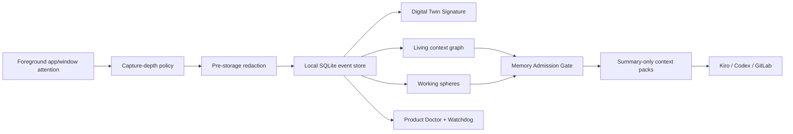

# Digital Twin Sensor

A local-first, privacy-gated digital twin sensor for personal context engineering and agent handoff.

Digital Twin Sensor observes lightweight computer-use signals on macOS, redacts sensitive information before storage, builds a living context graph, infers working spheres, and exports summary-only context packs for tools such as Kiro, Codex, and GitLab.

It is inspired by X-SYNTH, context engineering, and agent-memory research, but it makes one important product choice: a digital twin should not be a raw surveillance log. It should be an explainable, governed context system with visible user control.


## What You Can Do With It

- See what apps, domains, and work artifacts are getting your attention.
- Build a rolling Digital Twin Signature from observed focus patterns.
- Understand active and suspended work through working spheres.
- Generate resume packs for interrupted tasks.
- Export privacy-gated context packs for Kiro, Codex, GitLab issues, or local files.
- Inspect what was collected, what was inferred, and what was deliberately withheld.
- Keep the collector and dashboard alive with macOS LaunchAgents and a watchdog.
- Pause collection, resume collection, and purge expired local rows.
- Use the included research notes and product logs as the basis for a publishable context-engineering paper.

## Product Pipeline




## Privacy Boundary

Collected by default:

- active application
- redacted window title
- timestamp and dwell time
- derived work domain
- app-switching sequence
- derived graph/sphere/context-pack metadata

Not collected by default:

- keystrokes
- clipboard
- microphone
- camera
- raw screenshots
- browser cookies
- passwords or tokens
- raw browser URL paths, queries, or fragments
- raw cloud upload

PII masking is enabled before events are written to SQLite. The redactor masks emails, credit-card-like numbers validated with Luhn, US SSNs, phone numbers, IP addresses, common secret/token shapes, URL paths, and configured names.

## Quick Start

```bash
git clone <your-gitlab-repo-url>
cd digital-twin-sensor-starter
python3 -m venv .venv
source .venv/bin/activate
pip install -e .
digital-twin-sensor init
digital-twin-sensor collect-once
digital-twin-sensor profile
digital-twin-sensor ui
```

Open:

```text
http://127.0.0.1:8765/
```

Do not open `digital_twin_sensor/ui_static/index.html` directly for normal use. The dashboard needs the local API server.

## Install As A Background Sensor

```bash
chmod +x scripts/install_launch_agent.sh scripts/install_dashboard_agent.sh scripts/install_watchdog_agent.sh
scripts/install_launch_agent.sh
scripts/install_dashboard_agent.sh
scripts/install_watchdog_agent.sh
```

This installs:

- `com.local.digital-twin-sensor`: continuous collector
- `com.local.digital-twin-dashboard`: local dashboard at `127.0.0.1:8765`
- `com.local.digital-twin-watchdog`: scheduled self-heal check every 60 seconds

Check status:

```bash
digital-twin-sensor doctor
```

## macOS Permissions

The active-window collector uses macOS Accessibility APIs through a native helper or AppleScript fallback.

Open:

```text
System Settings -> Privacy & Security -> Accessibility
```

Enable the terminal app or Python runtime running the collector. When Depth 2 or Depth 3 app-specific metadata is enabled, macOS may also ask for Automation permission for Safari, Chrome, or allowlisted apps.

## Dashboard

The dashboard is a local web console with:

- Overview: live twin cockpit, fidelity score, focus sphere, and privacy posture
- Signal Depth: app attention, player visibility, capture-depth ladder, and eye-proxy planning
- Product Ops: service health, self-heal, paper deviations, hardening gaps, and research backlog
- Fleet: local endpoint posture, policy, connectors, and sync-readiness
- Activities: inferred working spheres, session returns, and resume packs
- Context Packs: Kiro/Codex/GitLab-ready gated Markdown or JSON
- Context Graph: privacy-gated work graph
- Twin Signature: behavioral vectors from attention traces
- Evidence: X-SYNTH-lite query retrieval with selected filters
- Events: local redacted event ledger
- Privacy: captured/not-captured ledger, pause/resume, and retention purge

## Showcase And Essay

A special website link is included at:

```text
showcase/index.html
```

It points to both the motion case study and the enterprise essay:

```text
showcase/motion-page/index.html
showcase/context-moat/index.html
```

Run a static server from the repository root:

```bash
python3 -m http.server 8770
```

Then open:

```text
http://127.0.0.1:8770/showcase/
http://127.0.0.1:8770/showcase/motion-page/
http://127.0.0.1:8770/showcase/context-moat/
```

## Common Commands

Collect and analyze:

```bash
digital-twin-sensor collect-once
digital-twin-sensor run --interval 15
digital-twin-sensor profile --short-days 5 --long-days 14
digital-twin-sensor query "what did I repeatedly return to?"
```

Generate context:

```bash
digital-twin-sensor graph --days 14
digital-twin-sensor activities --days 14
digital-twin-sensor context-pack --days 14 --target kiro --format markdown
digital-twin-sensor context-pack --days 14 --target gitlab --purpose gitlab --output work/context-pack.md
```

Operate safely:

```bash
digital-twin-sensor doctor
digital-twin-sensor watchdog --fix
digital-twin-sensor pause
digital-twin-sensor resume
digital-twin-sensor purge --older-than-days 30 --yes
```

Enable deeper capture:

```bash
digital-twin-sensor configure --depth 2 --browser-tab-details on --browser-url-path off --browser-url-query off
digital-twin-sensor configure --depth 3 --accessibility-surface-details on --accessibility-app "Ibo Pro Player"
```

Depth 3 stores redacted UI labels and roles only. It does not store screenshots, keystrokes, clipboard content, microphone input, camera input, or raw video.

## Architecture

The system is built from small local modules:

| Layer | Responsibility |
| --- | --- |
| Collector | macOS foreground app/window sampling with optional browser and Accessibility metadata |
| Redaction | PII, names, credit cards, tokens, IPs, and URL-path masking before storage |
| Store | local SQLite event ledger with retention deletion |
| Digital Twin Signature | domain, rhythm, baseline, response, and diversity vectors |
| Context graph | derived work graph over domains, apps, artifacts, tasks, time, and masked private signals |
| Working spheres | inferred activities, interruptions, returns, and resume packs |
| Context packs | purpose-gated Markdown/JSON export through Memory Admission Gate |
| Product Ops | doctor, watchdog, health API, paper deviations, product gaps, and research backlog |
| Dashboard | local web UI served from `127.0.0.1` |

Read the full technical architecture: [docs/ARCHITECTURE.md](docs/ARCHITECTURE.md)

## API

Local API endpoints include:

- `GET /api/overview`
- `GET /api/health`
- `GET /api/context-pack`
- `GET /api/query`
- `GET /api/fleet`
- `POST /api/collect-once`
- `POST /api/admin/watchdog`
- `POST /api/admin/pause`
- `POST /api/admin/resume`
- `POST /api/admin/purge-retention?confirm=purge-retention`

Read the API reference: [docs/API.md](docs/API.md)

## Documentation

| Document | Purpose |
| --- | --- |
| [docs/GETTING_STARTED.md](docs/GETTING_STARTED.md) | Installation and first run |
| [docs/ARCHITECTURE.md](docs/ARCHITECTURE.md) | System architecture and data flow |
| [docs/API.md](docs/API.md) | Local dashboard API |
| [docs/DEPLOYMENT.md](docs/DEPLOYMENT.md) | Local and enterprise deployment path |
| [docs/GITLAB_PUBLISHING.md](docs/GITLAB_PUBLISHING.md) | GitLab push, project metadata, and release commands |
| [docs/RESEARCH_AND_EVALUATION.md](docs/RESEARCH_AND_EVALUATION.md) | Study design and metrics |
| [showcase](showcase) | Special website link, motion case study, and enterprise context-moat essay |
| [COLLECTION_DEPTH_AND_REDACTION.md](COLLECTION_DEPTH_AND_REDACTION.md) | Capture-depth and masking policy |
| [CONTEXT_RESEARCH_SYNTHESIS_2024_2026.md](CONTEXT_RESEARCH_SYNTHESIS_2024_2026.md) | Last-three-year research synthesis |
| [PRODUCT_BUILD_LOG.md](PRODUCT_BUILD_LOG.md) | Product build and validation log |
| [SECURITY.md](SECURITY.md) | Vulnerability reporting and deployment cautions |
| [SECURITY_PRIVACY.md](SECURITY_PRIVACY.md) | Security and privacy posture |
| [ENTERPRISE_PORTABILITY.md](ENTERPRISE_PORTABILITY.md) | Fleet and enterprise portability model |

## Research Positioning

This project should be described as:

```text
a privacy-gated context synthesis system from digital attention traces
```

It should not yet be described as a faithful human replica.

Current research gaps:

- learned Query x Digital Twin Signature router
- feedback-labeled evaluation
- collective/team signal
- encrypted storage
- trust-calibration studies
- anti-overclaim benchmark

Good paper hypotheses:

- Privacy-gated context packs improve task resumption compared with no context or query-only retrieval.
- Working-sphere retrieval improves relevance for interrupted work compared with flat top-k event retrieval.
- Summary-only context packs reduce leakage risk while preserving enough utility for agent handoff.
- Visible product doctor diagnostics improve trust calibration compared with a hidden collector.

## Testing

```bash
python3 -m unittest discover -s tests
python3 -m compileall digital_twin_sensor
node --check digital_twin_sensor/ui_static/app.js
```

GitLab CI is included in `.gitlab-ci.yml`.

## License

MIT. See [LICENSE](LICENSE).
