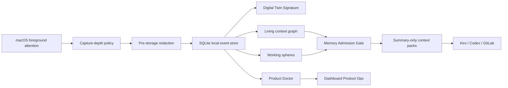
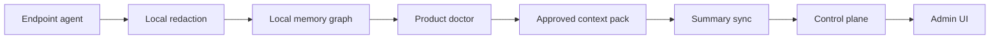

# Architecture

Digital Twin Sensor is a local-first context fabric for personal and enterprise agent handoff. It observes lightweight computer-use signals, redacts them before storage, builds derived memory structures, and exports governed context packs instead of raw event rows.


## System Goals

- Capture enough context to help a person or agent resume work.
- Avoid silent surveillance patterns.
- Keep raw observations local by default.
- Make every derived memory explainable through evidence and privacy gates.
- Expose product health, permission state, and research gaps in the UI.

## Runtime Components

| Component | File | Responsibility |
| --- | --- | --- |
| CLI | `digital_twin_sensor/cli.py` | Commands for init, collection, query, graph, activities, packs, doctor, watchdog, pause/resume, purge, and UI |
| macOS collector | `digital_twin_sensor/collectors/macos_active_window.py` | Foreground app/title/dwell capture with locked-session handling |
| Browser tab collector | `digital_twin_sensor/collectors/browser_tab.py` | Optional Safari/Chrome tab title and sanitized URL metadata |
| Accessibility collector | `digital_twin_sensor/collectors/accessibility_surface.py` | Optional allowlisted UI labels/roles for opaque apps |
| Redaction | `digital_twin_sensor/redaction.py` | PII/name/card/secret/URL masking before persistence |
| Store | `digital_twin_sensor/store.py` | SQLite event ledger plus retention deletion primitives |
| Digital Twin Signature | `digital_twin_sensor/twin.py` | Domain, rhythm, baseline, response, and diversity vectors |
| Context graph | `digital_twin_sensor/context_graph.py` | Derived graph over domains, apps, artifacts, tasks, time, and masked private signals |
| Working spheres | `digital_twin_sensor/working_spheres.py` | Activity clustering, return detection, transitions, and resume packs |
| Context packs | `digital_twin_sensor/context_pack.py` | Purpose-gated Markdown/JSON handoff for Kiro, Codex, GitLab, or local file |
| Retrieval | `digital_twin_sensor/query.py` | X-SYNTH-lite attention filters and evidence ranking |
| Fleet | `digital_twin_sensor/fleet.py` | Local endpoint posture, policy, connectors, and sync-readiness |
| Health | `digital_twin_sensor/health.py` | Product doctor, watchdog decisions, paper deviations, and research backlog |
| Dashboard | `digital_twin_sensor/web.py` + `ui_static/` | Local web console at `127.0.0.1` |

## Data Flow




## Capture Depth Model

| Depth | Name | Current status | Default boundary |
| --- | --- | --- | --- |
| 0 | Health only | Supported by system-state events | No foreground content |
| 1 | Attention metadata | Implemented | App, redacted title, dwell, domain, switch sequence |
| 2 | Work surface metadata | Implemented for Safari/Chrome tab metadata | URL paths, query strings, fragments, usernames, and passwords are redacted by default |
| 3 | Allowlisted UI metadata | Implemented for macOS Accessibility-compatible apps | UI labels and roles only; no screenshots, keystrokes, clipboard, microphone, or camera |
| 4 | Semantic summaries/OCR gate | Implemented for macOS Apple Vision helper | Store local redacted summary only, discard temporary images |
| 5 | Full content | Not enabled | Requires explicit connector opt-in, encryption, retention, and export controls |

## Storage Model

The local SQLite database is stored at:

```text
~/.digital-twin-sensor/events.sqlite
```

The `events` table stores:

- subject id
- source
- app
- redacted title
- artifact label
- derived domain
- action
- start/end timestamps
- dwell seconds
- metadata JSON

Derived structures are calculated at read time from the redacted event ledger. The project does not store a second graph database.

## Privacy And Governance Model

The product uses layered gates:

- Capture gate: controls which sensor depth is active.
- Redaction gate: masks sensitive text before storage.
- Graph minimization gate: converts sensitive findings into masked private-signal nodes.
- Memory Admission Gate: decides allow, summarize, generalize, mask, or deny for every context-pack field.
- Export boundary: sends context packs and health summaries, not raw event rows.

Hard default exclusions:

- keystrokes
- clipboard
- microphone
- camera
- raw screenshots
- browser cookies
- passwords/tokens
- raw URL paths and queries
- raw cloud upload

## Availability Model

macOS production-like local availability uses four user LaunchAgents:

```text
com.local.digital-twin-sensor     -> continuous collector
com.local.digital-twin-dashboard  -> local dashboard at 127.0.0.1:8765
com.local.digital-twin-watchdog   -> scheduled self-heal check every 60 seconds
com.local.digital-twin-learning   -> scheduled context-card refresh every 15 minutes
```

The watchdog and learning maintenance jobs are scheduled. They may show as `not running` between checks with last exit code `0`; that is healthy.

## UI Architecture

The dashboard is a zero-dependency local web app served by Python:

- `digital_twin_sensor/web.py`: HTTP routes and JSON payload builders
- `digital_twin_sensor/ui_static/index.html`: dashboard markup
- `digital_twin_sensor/ui_static/app.css`: visual system and responsive layout
- `digital_twin_sensor/ui_static/app.js`: rendering, API calls, graph/canvas views, and local controls

Primary dashboard tabs:

- Overview: live twin cockpit and summary metrics
- Signal Depth: what each app exposes and how to deepen safely
- Product Ops: doctor, watchdog, paper deviations, gaps, and research backlog
- Fleet: local endpoint control model
- Activities: working spheres and resume packs
- Context Packs: gated handoff payloads
- Context Graph: privacy-gated graph
- Twin Signature: behavioral vectors
- Evidence: attention-weighted retrieval
- Events: raw local ledger view
- Privacy: collection boundary, pause/resume, and retention purge

## Enterprise Extension Path

The intended enterprise architecture is:



Do not add remote raw event sync until encryption, signed installers, enrollment, retention controls, audit logs, and role-based access exist.
