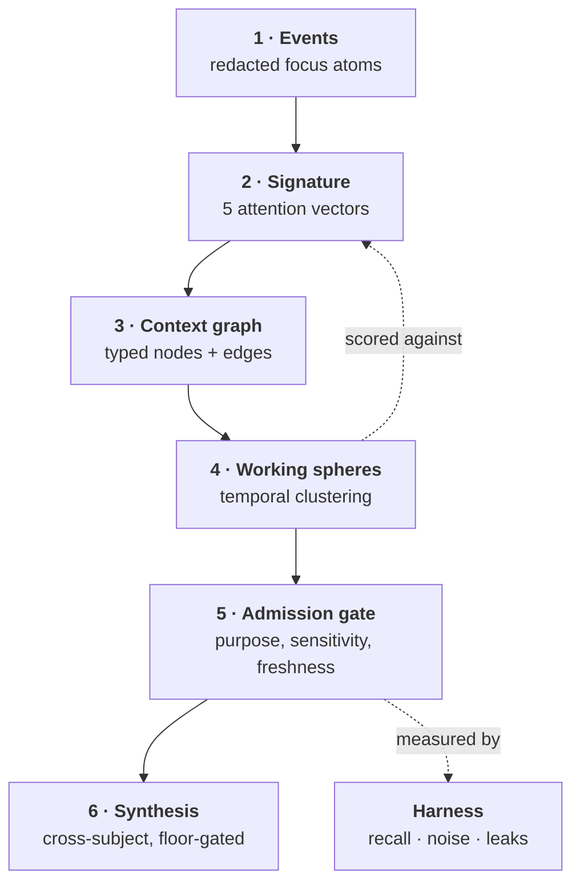

# Under the Hood

How context is actually captured, how this system defines attention, and what joins
the layers together. Every number below is in the code, not in a slide.

---

## 1. Capture — what a sensor event is

The collector samples the macOS foreground window on an interval (`run --interval 15`).
It does not stream. It does not hook input. Each sample becomes one event:

```json
{
  "app": "Kiro",
  "title": "payments gateway retry logic",
  "artifact": "payments gateway retry logic",
  "domain": "coding",
  "action": "focus",
  "ts_start": "…", "ts_end": "…",
  "dwell_seconds": 240.0,
  "metadata": { "redaction_findings": {"email": 1}, "privacy": "no_keystrokes_no_screenshots_no_clipboard" }
}
```

Three things happen before that row reaches SQLite, in this order:

1. **Depth policy** decides what may be read at all. Depth 1 is app plus window title.
   Depth 2 adds browser tab title and domain — URL path, query and fragment are separate
   flags, off by default. Depth 3 adds redacted Accessibility labels for allowlisted apps only.
2. **Domain classification** maps app plus title to a work domain via `domain_rules`.
3. **Redaction** masks emails, Luhn-valid card numbers, SSNs, phone numbers, IPs, token
   shapes, URL paths and configured names — and records *what it found* in
   `redaction_findings`, so the masking itself is auditable.

Redaction runs **before the write**, not before the query. That ordering is the whole
difference between a governed sensor and a surveillance log with a filter on top.

---

## 2. Attention — how the system defines it

Attention is not "time on screen". Dwell alone rewards the window you left open while
you went to lunch. The system models attention as a **distribution with a shape**,
computed in `twin.py` as the Digital Twin Signature:

| Vector | What it measures | How |
| --- | --- | --- |
| `v_dom` | where attention goes | dwell distribution across work domains |
| `v_rhythm` | when it goes there | hour-of-day histogram |
| `v_base` | what normal looks like | short window (5d) against long window (14d) |
| `v_resp` | how attention moves | domain-to-domain transition counts |
| `v_div` | how concentrated, how changed | Shannon entropy, plus KL divergence short vs long |

That last one earns its place. `KL(short ‖ long) > 0.2` means the recent week does not
look like the fortnight — the person's attention has shifted. The system uses that as a
trigger, not a statistic: retrieval automatically adds a `differential` filter when it fires.

### Attention filters

Retrieval (`query.py`) does not rank by relevance alone. It picks an **attention filter**
from cues in the question itself, then weights evidence by that filter:

| Filter | Cues in the question | What it surfaces |
| --- | --- | --- |
| `proportional` | *(default)* | what actually held attention |
| `inverse` | "missing", "ignored", "should have" | what was *neglected* — absence as signal |
| `differential` | "changed", "spike", "anomaly" | what shifted against baseline |
| `recurrent` | "again", "keeps coming back" | what was returned to repeatedly |
| `comparative` | "versus", "alternative" | what was evaluated against what |
| `sequential` | "then", "workflow", "order" | the order things were done in |
| `collective` | "team", "everyone" | cohort-level signal *(see the floor, §4)* |

Final rank is `attention_score × content_score`. Content alone finds the document; attention
decides whether the person was actually *working on it*. The `inverse` filter is the one
worth noticing — it treats what someone conspicuously did **not** look at as evidence,
which no document store can do.

---

## 3. The join layers

Six layers, each consuming the one below and discarding more than it keeps.



**Layer 3 — the graph** types everything: `domain`, `app`, `artifact`, `task`, `time`.
Edges carry dwell and event counts. Node score is
`dwell + events×5 + type_priority×120`, so a node earns its place by sustained
attention rather than by appearing once.

**Layer 4 — working spheres** is where interrupted work gets reconnected. Each incoming
event is scored against every open sphere and joins the best match above threshold:

| Signal | Weight |
| --- | --- |
| same normalised artifact | **0.46** |
| token overlap (Jaccard × 0.72) | up to **0.48** |
| same domain | 0.18 |
| same inferred task | 0.13 |
| same app | 0.12 |
| continuing the previous sphere within the session gap | 0.16 |
| ≥ 2 shared tokens | 0.08 |

Artifact identity and token overlap dominate deliberately. Same app and same domain are
weak evidence — a browser is a browser. Returning to *the same thing* is strong evidence,
and it is what lets the system say "you were interrupted here, three times" rather than
"you used Chrome for four hours".

**Layer 5 — the admission gate** is the only exit. Purpose must be declared, sensitivity
decides keep/mask/deny, freshness drops stale evidence and notes the gap, and the export
is re-redacted as defence in depth. Every pack carries what was withheld and why.

---

## 4. Synthesis — the layer above one machine

`synthesis.py` folds gated working spheres from many subjects into themes. It reads
**no raw events** and takes only opaque subject keys, and it enforces an aggregation
floor before anything is emitted:

```
a theme is emitted only when N distinct subjects independently support it
```

Below the floor, the theme is withheld **and counted**, so an operator sees that
suppression happened rather than quietly receiving a thinner answer. Confidence is
`0.65 × breadth + 0.35 × depth` — breadth is corroboration across people, depth is
volume. Weighting breadth higher is what stops one prolific person from manufacturing
a theme on their own; there is a test for exactly that.

This is the layer that makes anything above a single team defensible. It is also the
layer that must exist *before* deployment widens, not after — an aggregation floor is
cheap at ten endpoints and impossible to retrofit at ten thousand.

---

## 5. The harness

Unit tests prove a function returns what it was told to return. They cannot tell you
whether the context handed to an agent is good — relevant enough to be useful, tight
enough to be safe.

`harness.py` runs a golden set end to end and scores it:

| Metric | Meaning |
| --- | --- |
| **recall** | did the pack surface what the scenario says it must? |
| **noise ratio** | how much surfaced material was not expected? |
| **leaks** | did a canary reach an export? *hard failure, any count* |
| **evidence age** | how stale was the newest supporting evidence? |
| **pack size** | how much is being sent? |
| **gate counts** | allow / mask / deny decisions taken |

```bash
digital-twin-sensor harness                    # markdown report
digital-twin-sensor harness --format json      # machine-readable
digital-twin-sensor harness --fail-under 0.8   # tighten the recall floor
```

Non-zero exit on any leak or a recall miss, and it runs in CI, so a context regression
breaks the build exactly like a failing test.

> **It earned its keep immediately.** On its first run the harness failed
> `stale_evidence`: events 60 days old were being exported inside a 3-day window.
> The `days` argument was threaded through the builders as *metadata* and enforced only
> by `EventStore.fetch_window`. Any caller passing events directly — a batch job, a
> future control plane, a test — got stale evidence stamped with a fresh window.
> Fixed in `store.filter_window`, enforced in all three builders, regression test in
> `tests/test_harness.py`. Twenty-two unit tests had not found it in months.

---

## 6. Known gaps

Honest list. These are the things that stand between this prototype and an enterprise
deployment, roughly in the order they would bite.

| Gap | Why it matters | Status |
| --- | --- | --- |
| **Store is unencrypted SQLite** | a laptop at rest is the whole threat model | ⬜ designed |
| **Redaction is regex-only** | 120 lines catch patterns, not unlisted human names; needs NER | 🟡 partial |
| **No event-schema versioning** | a field rename orphans existing local history | ⬜ designed |
| **Retrieval is lexical** | token overlap misses synonymy; needs embeddings + a learned router | ⬜ designed |
| **No feedback capture** | H1–H5 stay untestable without labelled outcomes | ⬜ designed |
| **Sphere weights are hand-tuned** | the seven weights above are judgement, not fitted | 🟡 partial |
| **Synthesis floor is count-based** | k-anonymity only; no differential privacy on aggregates | 🟡 partial |
| **No pack provenance signature** | a receiving agent cannot verify a pack was gated | ⬜ designed |
| **No control plane** | enrolment, policy distribution, audit log all unbuilt | ⬜ designed |
| **macOS only** | Windows and Linux collectors unwritten | ⬜ designed |

The first four are what a security review would open with. The synthesis floor is the one
that decides whether tier 3 and above are honest — count-based k-anonymity is a real floor
but it is not a proof, and aggregate queries can still leak across repeated runs.
